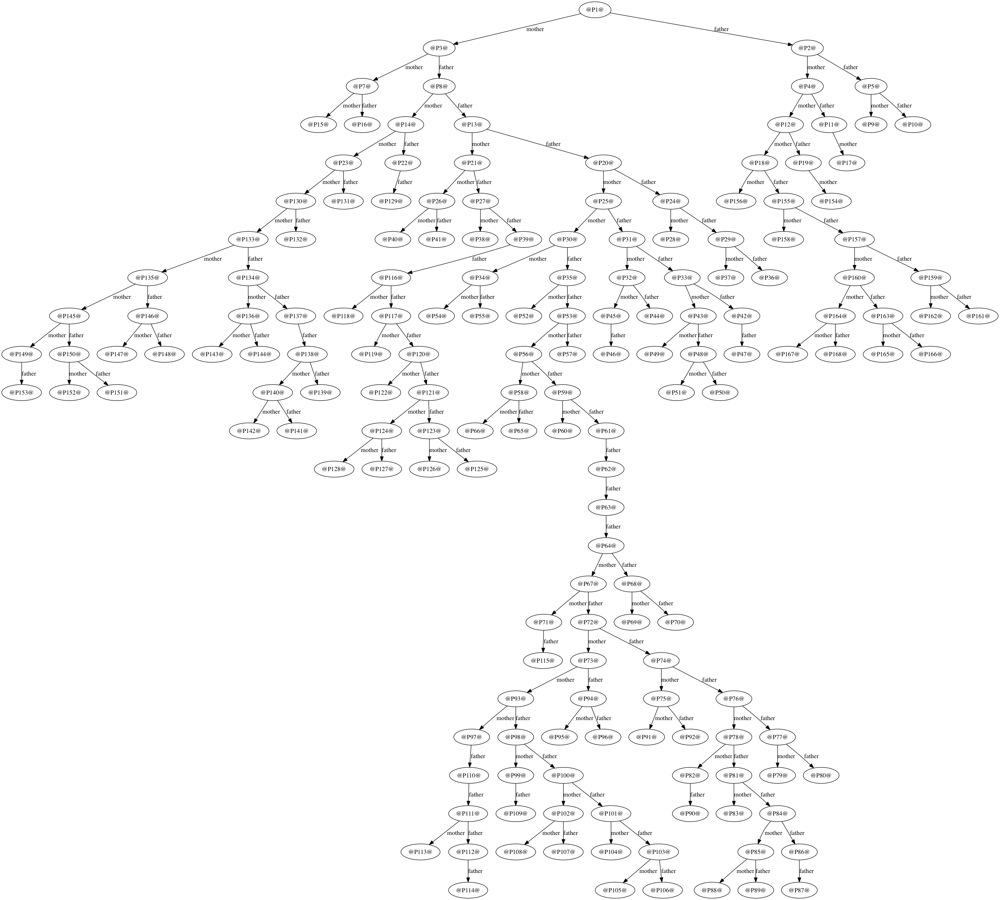

### ActiveGedcom

This is a super naive parser POC for GEDCOM.

### EXAMPLE

``` ruby
ruby -I'lib' \
	-ractive_gedcom \
	-e "puts ActiveGedcom::Gedcom.new('my-family-tree.ged').to_dot" \
	> my.dot
dot -Tpng my.dot -o my.png
open my.png
```

This currently generates an image like this:

